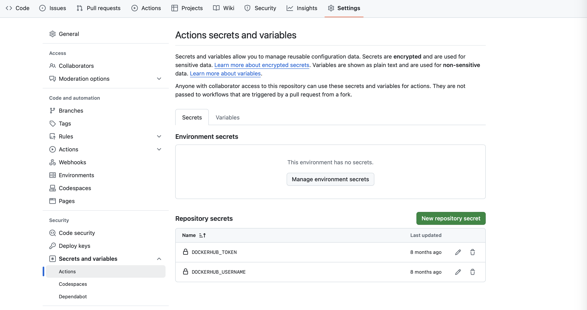

# quarkus-github-action
A GitHub Action file that checks out, packages, builds and pushes a Docker container

## Requirements
You need to add 2 secrets to your repository's Actions: your Docker hub username and token

## Description
The build uses Temeurin Java 21.  Check with actions/setup-java@v4 to change the version.

The Docker container uses the POM's artifactId for the name of the container and the POM's version for version.  The container is also tagged, "latest."

## To Use
Drop the .github directory into your Quarkus project

